# Project Architecture Overview 🏗️

This document provides a comprehensive overview of the Tech Xplore platform architecture, including the main components, data flow, and how everything fits together to deliver AI-driven financial and sustainability advisory services.

---

## System Architecture

Tech Xplore consists of two main repositories working together:

```mermaid
graph TB
    User[👤 User] --> Frontend[🖥️ React Frontend]
    Frontend --> ChatAgent[🤖 ChatAgent]
    ChatAgent --> McpAgent[🔧 MCP Agent]
    McpAgent --> API[🌐 Backend API]
    
    subgraph "Tech-Xplore-2025"
        Frontend
        ChatAgent
        McpAgent
    end
    
    subgraph "Tech-Xplore-API-2025"
        API
    end
    
    API --> Financial[💰 Financial Data]
    API --> Sustainability[🌱 ESG Data]
    API --> Carbon[🌍 Carbon Tracking]
```



---

## Components

### 1. Frontend (React) 💻

**Location:** `src/app.tsx`, `src/components/`  
**Purpose:** Provides a chat UI for users to interact with the agent  
**Technology:** React, Tailwind CSS, Vite  
**Customizable:** Yes! Add new UI components or change the look and feel easily

#### Key Features:
- Real-time chat interface
- Responsive design for mobile and desktop
- Tool invocation confirmations
- User management and preferences
- Modern UI components with Tailwind CSS

#### Key Files:
- `app.tsx`: Main chat interface
- `components/`: Reusable UI components
- `styles.css`: Tailwind CSS styling
- `hooks/`: Custom React hooks
- `providers/`: Context providers for state management

### 2. MCP (Cloudflare Worker) 🛠️

**Location:** `src/server.ts`, `src/chat.ts`, `src/mcp.ts`, `src/tools.ts`  
**Purpose:** Handles API requests, routes messages, and exposes tools via the MCP protocol  
**Customizable:** Yes! Most development work involves adding new tools in `src/chat.ts` and `src/mcp.ts`

#### Key Files:
- `server.ts`: Entry point, request routing
- `chat.ts`: ChatAgent definition
- `mcp.ts`: MCP Agent and tool definitions
- `tools.ts`: Tool registration and confirmation logic

#### Backend API Integration 🔗

**Repository:** Tech-Xplore-API-2025  
**Purpose:** Provides the backend infrastructure with comprehensive financial and sustainability advisor APIs

**Features:**
- Financial advice and spending insights
- ESG investment recommendations
- Carbon footprint tracking and sustainability tips
- Comprehensive Swagger/OpenAPI documentation

**Integration:** The MCP tools call these backend APIs to provide rich financial and sustainability data to users

**Documentation:** Full API documentation available at `/ui` (Swagger UI) and `/doc` (OpenAPI spec)

### 3. Secrets & Configuration 🔐

**Local:** `.dev.vars` (not committed to version control)  
**Production:** Cloudflare Worker secrets (set via CLI or dashboard)  
**Reference:** [Secrets & Environment Variables Guide](./secrets-and-env)

#### Configuration Types:
- **Model Providers**: Azure OpenAI, OpenAI API
- **API Endpoints**: Backend API URLs
- **Authentication**: API keys and tokens
- **Feature Flags**: Development and production toggles

### 4. Model Providers 🤖

**Supported Providers:**
- **Azure OpenAI**: Enterprise-grade AI with custom deployments
- **OpenAI API**: Direct integration with OpenAI's models
- **Configurable via secrets**: Easy switching between providers

#### Model Capabilities:
- Natural language understanding
- Financial analysis and recommendations
- Sustainability insights
- Tool usage decision making

### 5. Agents 🤖

There are 2 agents involved in this implementation, both implemented as specialized Cloudflare [Durable Objects](https://developers.cloudflare.com/durable-objects/):

#### ChatAgent 💬

**File:** `src/chat.ts`  
**Purpose:** The chatbot that users interact with directly

**Functionality:**
- Each user is routed to a unique ChatAgent instance (user ID = agent ID)
- Maintains personalized state and conversation history
- Access to two sets of tools:
  1. Tools exposed remotely by the McpAgent
  2. Local tools defined within the ChatAgent

**Documentation:** [Cloudflare ChatAgent API](https://developers.cloudflare.com/agents/api-reference/agents-api/#chat-agent)

#### McpAgent 🔧

**File:** `src/mcp.ts`  
**Purpose:** Simultaneously acts as an MCP server and an agent

**Functionality:**
- Exposes tools to the ChatAgent via MCP protocol
- Performs AI completions and reasoning
- Provides access to backend APIs
- Manages tool invocations and confirmations

**Documentation:** [Cloudflare McpAgent API](https://developers.cloudflare.com/agents/model-context-protocol/mcp-agent-api/)

---

## Data Flow

The following diagram illustrates how data flows through the Tech Xplore system:


### Detailed Flow:

1. **User Interaction**: User types a message in the chat UI in their browser
2. **Frontend Processing**: React frontend sends the message to the Cloudflare Worker backend
3. **Request Routing**: Worker processes the message in `server.ts`, routing to either ChatAgent or returning static assets
4. **Agent Processing**: Each user is routed to a unique ChatAgent instance, which uses the model provider to decide what tools to invoke
5. **Tool Execution**: McpAgent exposes tools via MCP protocol that the ChatAgent can call
6. **API Integration**: Tools make calls to the backend API for financial and sustainability data
7. **Response Generation**: AI model generates responses based on tool results and conversation context
8. **User Display**: Responses are sent back to the frontend and displayed in the chat UI

---

## API Architecture

### Tech-Xplore-API-2025 Structure

The backend API is organized into several categories:

#### Core APIs
- **Transactions**: Enhanced transaction insights with carbon impact
- **Investments**: Investment suggestions with ESG scoring
- **Carbon Tracking**: Footprint monitoring and reduction tips

#### Financial Advisor APIs
- **Financial Health**: Personalized analysis and scoring
- **Spending Insights**: Detailed spending pattern analysis
- **Recommendations**: Combined financial and sustainability advice

#### Sustainability Advisor APIs
- **ESG Investments**: Environmental, social, governance focused recommendations
- **Sustainability Tips**: Weekly challenges and eco-friendly suggestions

#### Documentation
- **OpenAPI Specification**: Complete API documentation
- **Swagger UI**: Interactive testing interface
- **Mock Data**: Realistic South African financial scenarios

---

## Integration Patterns

### MCP Tool Integration

Tools in the MCP Agent can call backend APIs to provide rich responses:

```typescript
// Example tool calling backend API
.tool('getSpendingInsights', 'Analyze spending patterns', {
  userId: z.string(),
  timeframe: z.string()
}, async ({ userId, timeframe }) => {
  const response = await fetch(`${API_BASE_URL}/api/spending-insights`, {
    method: 'POST',
    body: JSON.stringify({ userId, timeframe })
  });
  return await response.json();
})
```

### Authentication Flow


### Error Handling

The system implements comprehensive error handling at multiple levels:

- **Frontend**: User-friendly error messages and retry mechanisms
- **ChatAgent**: Graceful degradation when tools fail
- **McpAgent**: Fallback responses when API calls fail
- **Backend API**: Detailed error responses with proper HTTP status codes

---

## Deployment Architecture

### Local Development

```
localhost:8788  ← React Frontend
      ↓
localhost:8788  ← MCP Agent Worker
      ↓
localhost:8787  ← Backend API
```

### Production Deployment

```
your-mcp-agent.workers.dev  ← MCP Agent & Frontend
              ↓
your-api.workers.dev       ← Backend API
              ↓
External Services          ← Model Providers (Azure OpenAI/OpenAI)
```

### Scaling Considerations

- **Durable Objects**: Automatic scaling and state management
- **Edge Computing**: Global distribution via Cloudflare's network
- **API Rate Limiting**: Built-in protection against abuse
- **Caching**: Intelligent caching for improved performance

---

## Security Architecture

### Authentication & Authorization
- Environment-based secrets management
- API key rotation capabilities
- User session management
- Tool execution permissions

### Data Protection
- No persistent storage of sensitive data
- Encrypted communication channels
- Secure API endpoints
- Input validation and sanitization

### Compliance
- Designed for financial data handling
- Privacy-first architecture
- Audit logging capabilities
- GDPR-friendly data practices

---

## Monitoring & Observability

### Logging
- Cloudflare Workers analytics
- Custom application logs
- Error tracking and alerting
- Performance monitoring

### Metrics
- API response times
- Tool execution success rates
- User engagement analytics
- System health monitoring

---

## Useful Links

- [Cloudflare Workers Documentation](https://developers.cloudflare.com/workers/)
- [Cloudflare AI Agents Documentation](https://developers.cloudflare.com/agents/)
- [Model Context Protocol](https://modelcontextprotocol.io/)
- [Vite Documentation](https://vitejs.dev/)
- [React Documentation](https://react.dev/)

---

## Next Steps

For more details on each component:

- **[Development Guide](./development)** - Learn how to modify and extend the system
- **[Secrets & Environment](./secrets-and-env)** - Configure your development and production environments
- **[MCP Clients](./mcp-clients)** - Connect different clients to your MCP agent
- **[Troubleshooting](./troubleshooting)** - Common issues and solutions

Ready to dive into the code? Check out the [Development Guide](./development) for hands-on instructions! 🚀 